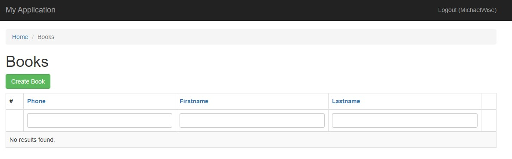

## Установка

~~~
sudo docker-compose up -d && \
sudo docker-compose run --rm php composer install && \
sudo docker-compose exec php php yii migrate  
~~~

## Doc

### Авторизация

При заходе на сайт если вы не авторизованы вам предложит авторизоваться, если вы уже авторизованы то в низу форму 
есть ссылка на форму регистрации

### Регистрация

 
Для регистрации необходимо ввести Username английскими буква без пробелов и знаков, email - он не должен быть занят
другим пользователем, password  - не должен быть меньше 5 символов 
 
### Список контактов

После регистрации вы попадаете на страницу с контактами

#### Создать контакт

Для того чтобы лобавить контакт необходимо нажать на кнопку `Create Book`

После откроется форма в которой обязательные поля отмеченны звездочками `*`

Для редактирования контакта необходимо выбрать данный значек карандаша 

Для удаления контакта необходимо выбрать данный значек корзины 

При обновлении контакта если картинка уже была загружена хоть один раз, то ее удалить нельзя и можно только изменить новой 

